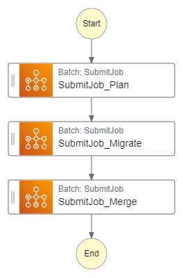

# Step Functions Prototype in Amazon States Language (ASL)



Input:

```json
{
  "sourcePath": "s3://aws-batch-demo-dotnet-source-bucket",
  "destinationPath": "s3://aws-batch-demo-dotnet-destination-bucket/output/",
  "planPath": "s3://aws-batch-demo-dotnet-destination-bucket/plans/plan-01.json",
  "filesToProcess": 2
}
```

```json
{
  "Comment": "Runs plan -> migrate -> merge",
  "StartAt": "SubmitJob_Plan",
  "States": {
    "SubmitJob_Plan": {
      "Type": "Task",
      "Resource": "arn:aws:states:::batch:submitJob.sync",
      "Parameters": {
        "JobName": "aws-batch-dotnet-plan-01",
        "JobDefinition": "arn:aws:batch:us-east-1:788770553757:job-definition/aws-batch-dotnet-plan:3",
        "JobQueue": "arn:aws:batch:us-east-1:788770553757:job-queue/MainQueue",
        "SchedulingPriorityOverride": 1,
        "ShareIdentifier": "demobatch*",
        "ContainerOverrides": {
          "Command.$": "States.Array('plan', '--source', $.sourcePath, '--destination', $.destinationPath, '--plan', $.planPath)"
        }
      },
      "Next": "SubmitJob_Migrate",
      "ResultPath": "$.submitResult"
    },
    "SubmitJob_Migrate": {
      "Type": "Task",
      "Resource": "arn:aws:states:::batch:submitJob.sync",
      "Parameters": {
        "JobName": "aws-batch-dotnet-migrate-01",
        "JobDefinition": "arn:aws:batch:us-east-1:788770553757:job-definition/aws-batch-dotnet-migrate:3",
        "JobQueue": "arn:aws:batch:us-east-1:788770553757:job-queue/MainQueue",
        "SchedulingPriorityOverride": 1,
        "ShareIdentifier": "demobatch*",
        "ContainerOverrides": {
          "Command.$": "States.Array('migrate', '--plan', $.planPath)"
        },
        "DependsOn": [
          {
            "JobId.$": "$.submitResult.JobId"
          }
        ],
        "ArrayProperties": {
          "Size": 2
        }
      },
      "Next": "SubmitJob_Merge",
      "ResultPath": "$.submitResult"
    },
    "SubmitJob_Merge": {
      "Type": "Task",
      "Resource": "arn:aws:states:::batch:submitJob.sync",
      "Parameters": {
        "JobName": "aws-batch-dotnet-merge-01",
        "JobDefinition": "arn:aws:batch:us-east-1:788770553757:job-definition/aws-batch-dotnet-merge:3",
        "JobQueue": "arn:aws:batch:us-east-1:788770553757:job-queue/MainQueue",
        "SchedulingPriorityOverride": 1,
        "ShareIdentifier": "demobatch*",
        "ContainerOverrides": {
          "Command.$": "States.Array('merge', '--source', $.destinationPath)"
        },
        "DependsOn": [
          {
            "JobId.$": "$.submitResult.JobId"
          }
        ]
      },
      "ResultPath": "$.submitResult",
      "End": true
    }
  }
}
```


## Reference

* <https://docs.aws.amazon.com/step-functions/latest/dg/terraform-sfn.html>
* <https://aws.amazon.com/blogs/devops/best-practices-for-writing-step-functions-terraform-projects/>
* <https://docs.aws.amazon.com/step-functions/latest/dg/input-output-contextobject.html>
